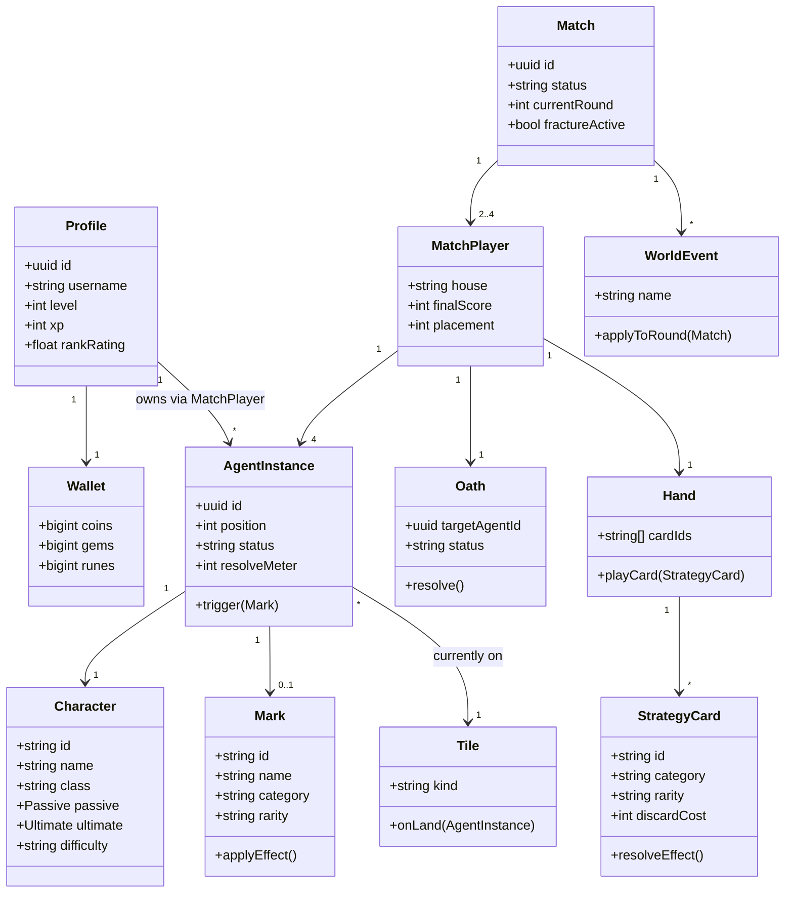
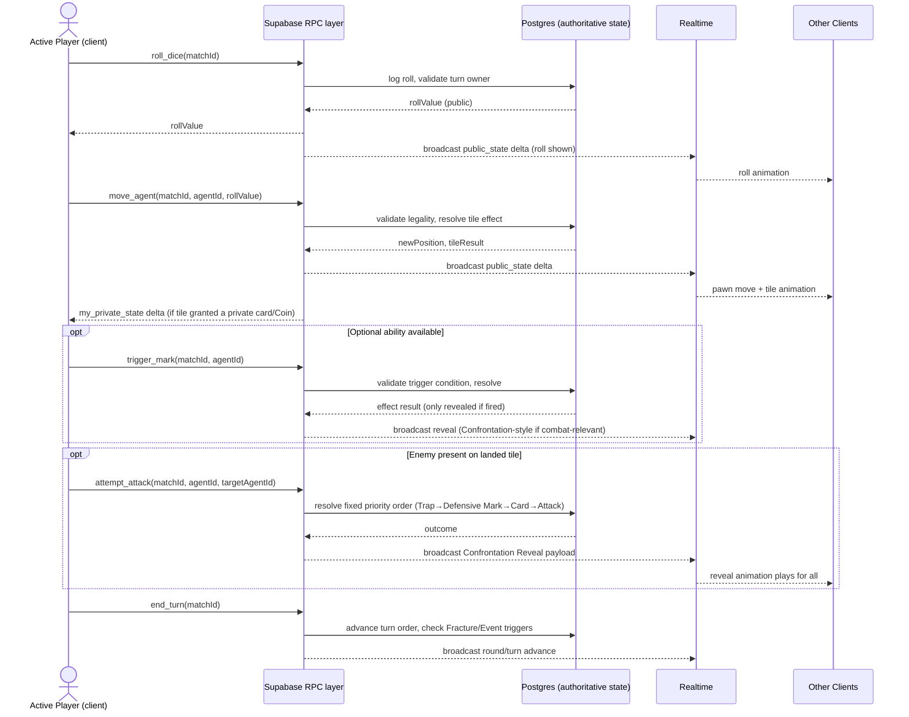
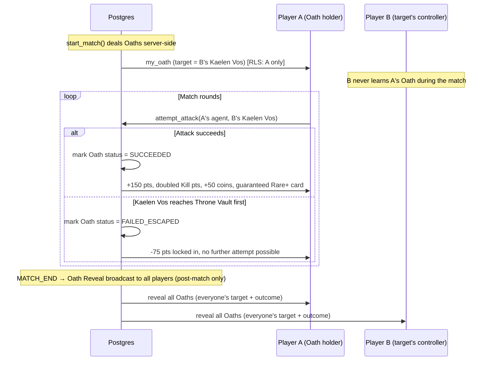
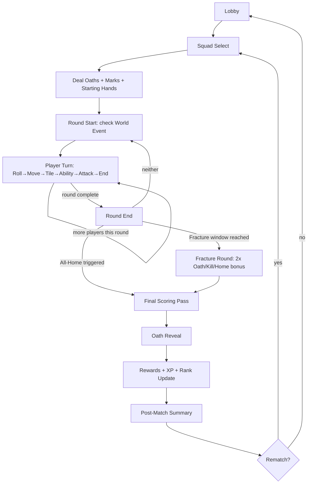
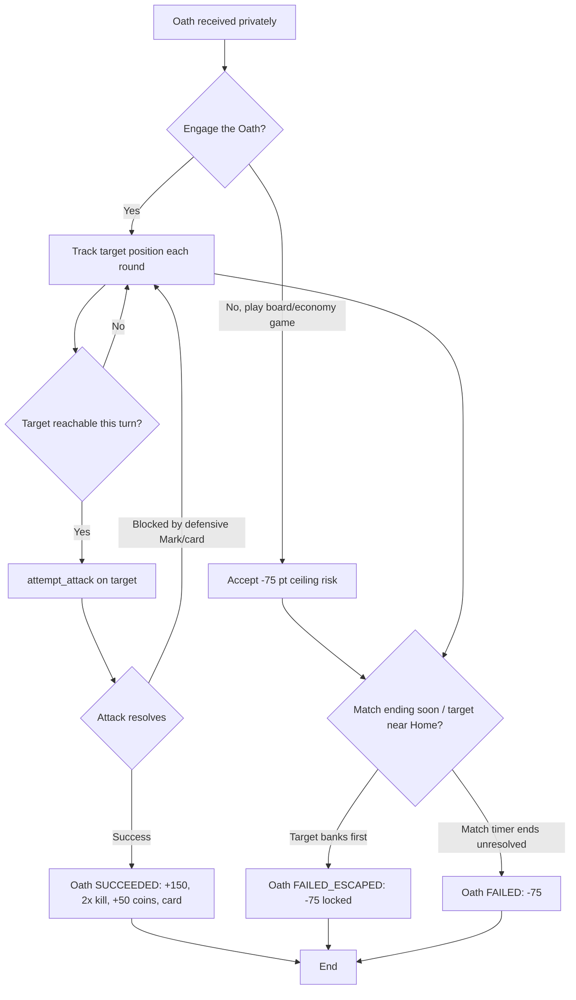
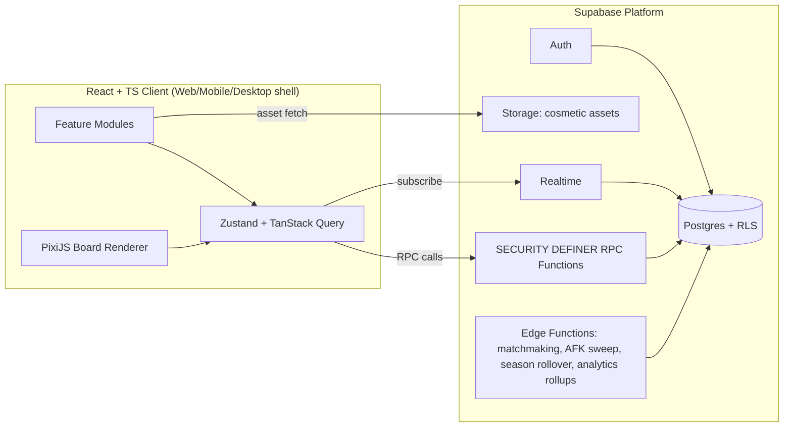

# 10 — Class Diagrams, Sequence Diagrams, Flowcharts, UML

## 1. Domain Class Diagram

## 2. Sequence Diagram — Standard Turn Resolution

## 3. Sequence Diagram — Blood Oath Lifecycle

## 4. Match Flow Chart

## 5. Assassin Challenge Decision Flow (Player-Facing Logic)

## 6. Component/UML Deployment View

